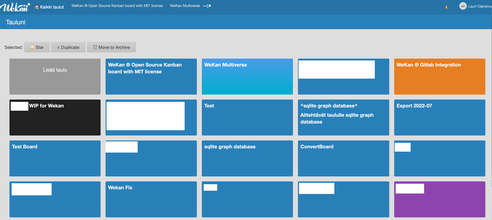

# WeKan Studio

## Description

TL;DR

- BLWRSL (Blow Resilient) (BSD/Linux/Mac/Windows / Redbean / SQLite / Lua). Similar like LAMP (Linux/Apache/MySQL/PHP).
- One executeable: Redbean/Lua/SQLite + .zip file at end of same executeable. Like Go, but same executeable works at Windows/Mac/Linux/BSD, no need for separate exe per OS/CPU.
- SSR (Server Side Rendering). Like Web 1.0, with HTML/CSS at frontend using HTML Forms with POST/GET. Redbean at backend. Similar like LAMP.
- Tested with all browsers, works also without Javascript:
  - Modern browsers based on: Chromium, Firefox, Safari
  - Upcoming browsers: Ladybird
  - Limited Javascript: Netsurf, Amiga IBrowse
  - Without Javascript: Lynx, Links, FreeDOS Dillo
  - Legacy browsers: Netscape, IE
- If browser has Javascript support, Javascript code can use https://unpoly.com for additional effects.
- No cookies. No localstorage. Sessions stored to serverside database, based on browser properties. More info at https://github.com/wekan/wekanstudio/blob/main/docs/roadmap.md#sessions

## General purpose web framework

This is general purpose web framework for creating any app, having features from:

- WeKan Open Source kanban https://wekan.github.io https://github.com/wekan/wekan/wiki/Deep-Dive-Into-WeKan
  - Same features, with changes to use minimal amount of code
  - Same API:
    - https://wekan.github.io/api/ 
    - https://github.com/wekan/wekan/blob/main/api.py
- WeKan Multiverse prototypes https://github.com/wekan/wekan/wiki/WeKan-Multiverse-Roadmap
- Database structure is same as in WeKan Open Source kanban https://wekan.github.io https://github.com/wekan/wekan (also features will be same and more),
  when exported to SQLite with https://github.com/wekan/minio-metadata

Web framework is based on:

- [Cosmopolitan](https://github.com/jart/cosmopolitan) cross-platform one executeable for Windows/Mac/Linux/BSD x86_64/arm64. There is no need for separate executeable for each CPU/OS.
- [Blink](https://github.com/jart/blink), that is x86_64 emulator faster than Qemu. With Blink, it is possible to run also at s390x, RISC-V etc, running like `blink wekan.com`.
- [Redbean](https://redbean.dev) webserver tech, where to end of C89/SQLite3/Lua server executeable is added Lua code and HTML/CSS/images etc like .zip file, files read from there directly without extracting
- [SQLite3](https://sqlite.org) database, that is included to Redbean.
- [Fullmoon](https://github.com/pkulchenko/fullmoon) Lua web framework, that is designed for Redbean webserver.
- [Petclinic](https://github.com/xet7/pet) example, that was ported from Java to Fullmoon, and added code that makes possible to use same SQLite database from many CGI-like Lua processes.

Native apps will be added for many CPU/OS. They will use same WeKan APIs, and native hardware features.

## Security

See https://redbean.dev about DDoS protection, sandboxing, asan and other security features.

If you know about any other technology, that can handle DDoS without CloudFlare, please email support@wekan.team

## Docs

How to build and run `wekan.com`:

https://github.com/wekan/wekanstudio/blob/main/docs/starting.md

Also other Docs at https://github.com/wekan/wekanstudio/tree/main/docs

## Screenshot

In WeKan Studio, showing current visual look of `All Boards` page of WeKan Open Source kanban https://wekan.github.io

More info about progress at https://github.com/wekan/wekanstudio/blob/main/CHANGELOG.md

